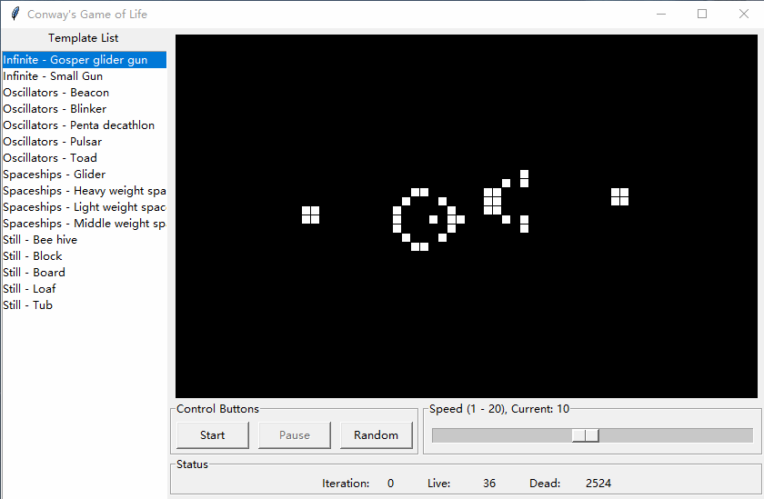

# GSOC2020 JdeRobot Python Challenge: Conway's Game of Life

A conway's game of life simulator that built with `Tkinter` and `Numpy`.

## How to Use
Start application from terminal:
```bash
python3 conways-game-of-life.py
```

## Screenshots


## Download
To download the code, you may need this tool: [GitZIP](https://kinolien.github.io/gitzip/).